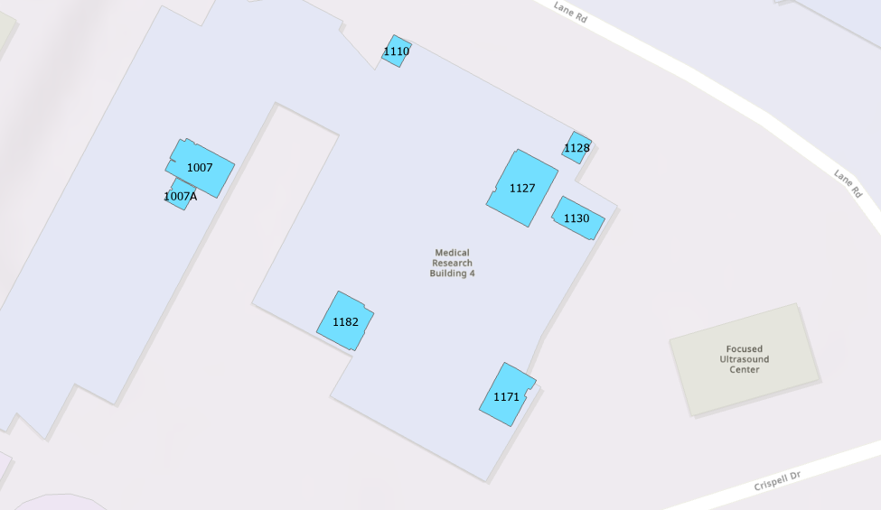
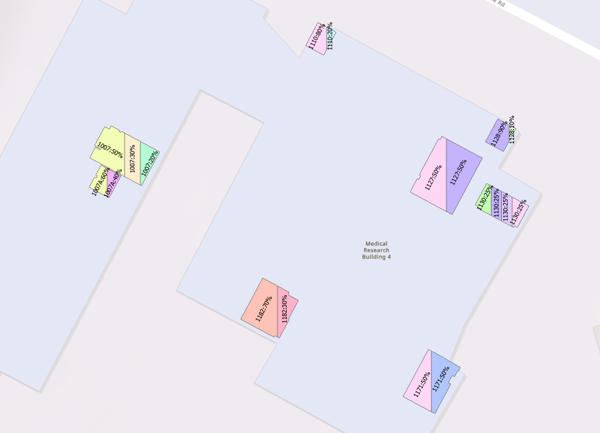

# Divide Room Polygons Based On the Shared Area Percentages

This project aims to divide room polygons stored in a feature class (Shared_Room_polygons in Devide_Polygons.gdb) based on shared percentage allocations recorded in Shared_Room_Table_Table using an ArcGIS Pro notebook.

With the arcpy module, we iterate through each room polygon and use the cut function to split it according to the percentages stored in Shared_Room_Table. The resulting split polygons are then saved in the split_polygons feature class.

If the cut line passes through a vertex, the cut function may fail, causing an error. To handle this, we implement a try-except clause.

# Before cutting

# After cutting

